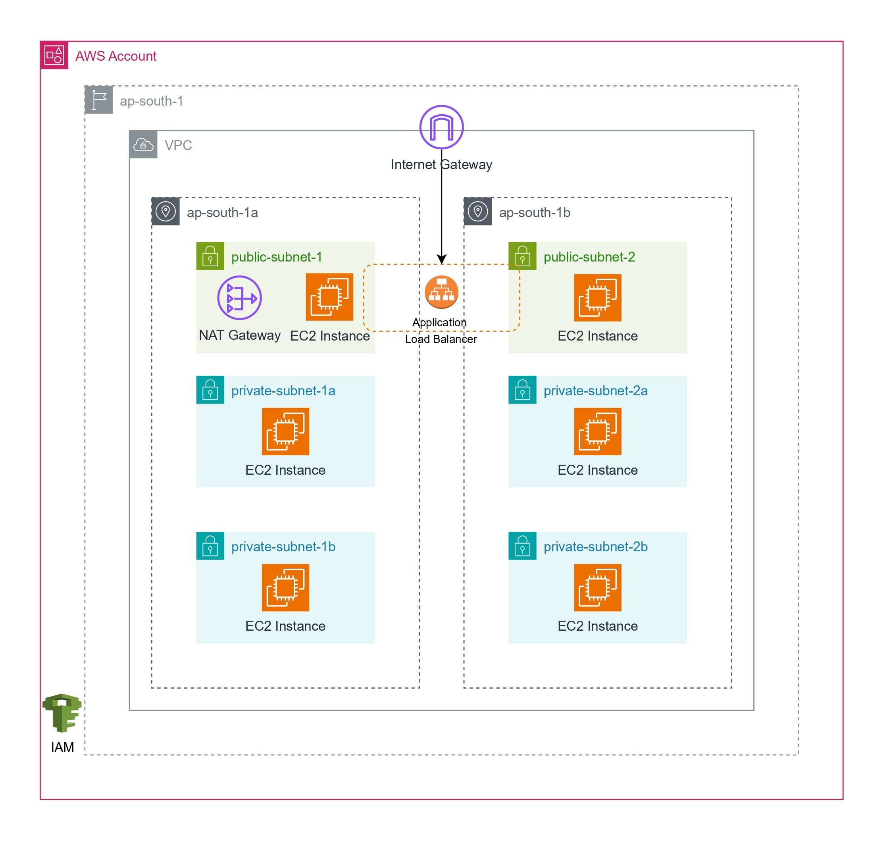

# 3-Tier Infrastructure

## Architecture


## Resources
This repo will create the following resources in the Mumbai region:
1. VPC
2. Subnets:
    - Public subnets: 2
    - Private subnets: 4
3. Internet Gateway
4. NAT Gateway (Zonal)
5. Route tables and their associations:
    - Public route table
    - Private route table
6. Security Groups: 4
7. EC2 instances:
    - Public subnet will have **2** instances
    - Private subnet will have **4** instances
8. Launch Template
9. Load Balancer

## Prerequisites
- Terraform
- AWS CLI

You'll need to configure your local machine:
```bash
aws configure
```

## How to Apply

**Step 1: Initialize**
```bash
terraform init
```

**Step 2: Check syntax**
```bash
terraform validate
```

**Step 3: Preview changes**
```bash
terraform plan
```

**Step 4: Apply**
```bash
terraform apply

# or, to skip the confirmation prompt
terraform apply --auto-approve
```

**Step 5: Destroy**
```bash
terraform destroy
```